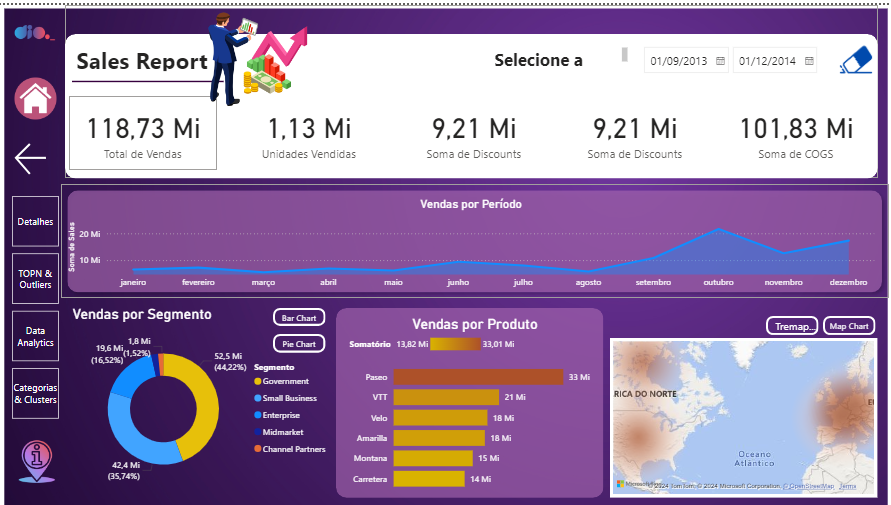
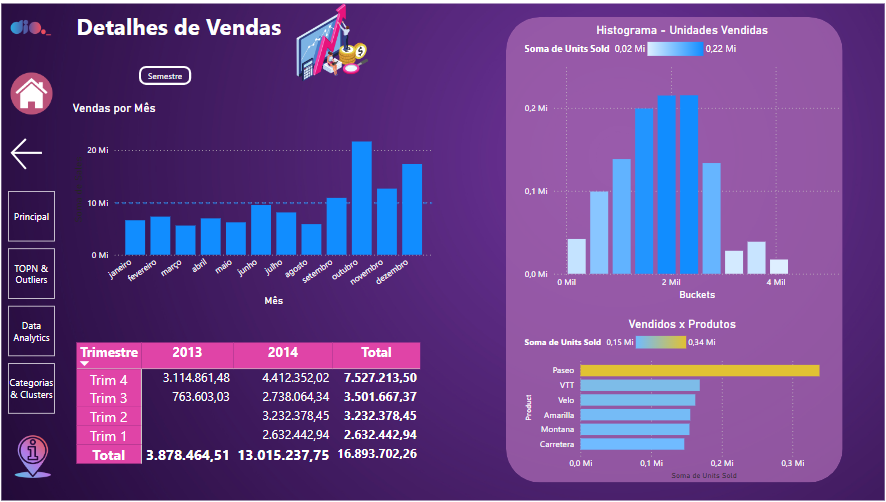
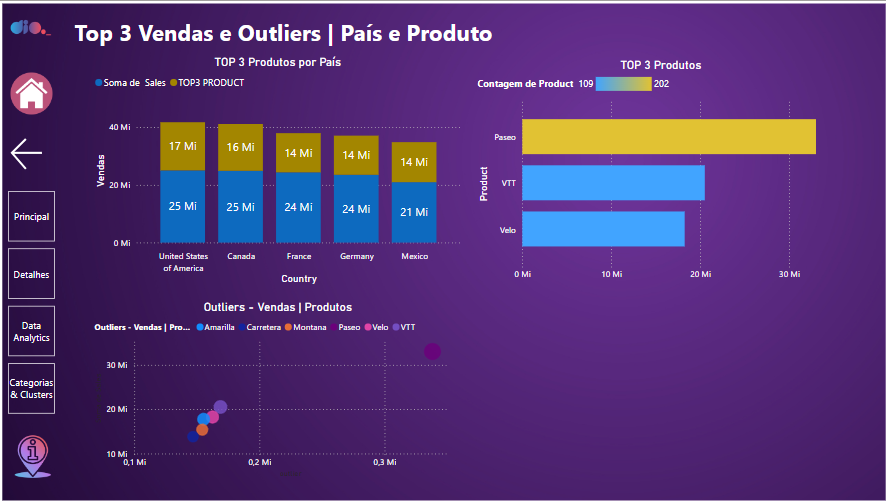
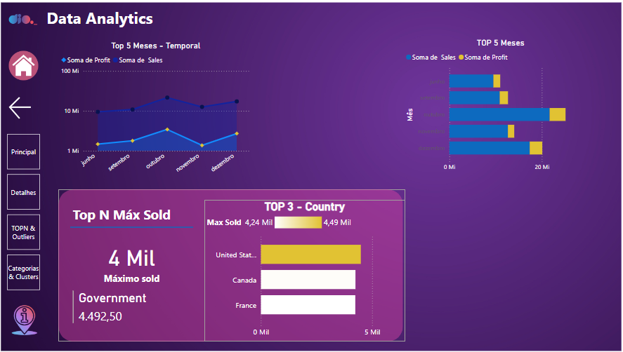
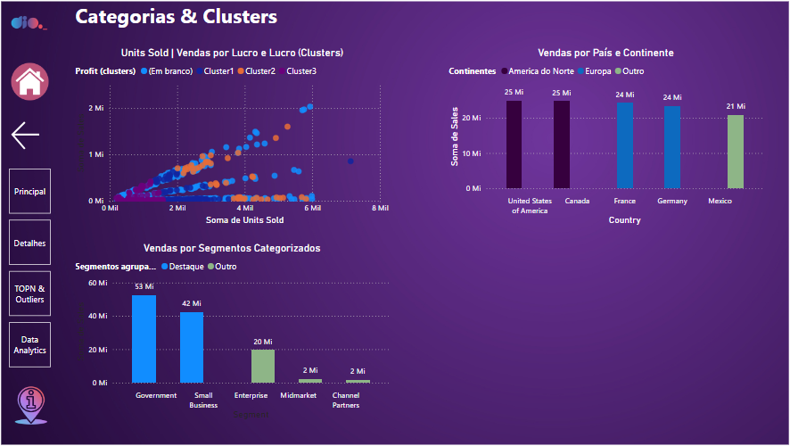

# Relatório Financeiro - Power BI Analyst

Este projeto apresenta um relatório financeiro interativo desenvolvido com Power BI, parte da formação Power BI Analyst. O dashboard oferece uma visão abrangente das vendas, permitindo análises detalhadas e insights valiosos para tomada de decisões.

O projeto online pode ser visto aqui [Report Financeiro](https://app.powerbi.com/view?r=eyJrIjoiZDljZDUxMDEtZjQ5ZS00ZDBiLWEwYTgtYWMwOWNkMDkzZmFhIiwidCI6IjdmMDJiNjQwLWFiNTAtNDY4My1hODk1LWM1Mjk1MjM3YzA3ZiIsImMiOjR9)

## Funcionalidades

- **Visão Geral de Vendas**: Métricas chave incluindo total de vendas, unidades vendidas, descontos e custos.
- **Análise Temporal**: Gráfico de vendas por período, permitindo identificar tendências e sazonalidades.
- **Segmentação de Vendas**: Visualização das vendas por segmento de mercado e por produto.
- **Mapa de Vendas**: Distribuição geográfica das vendas.
- **Detalhamento de Dados**: Possibilidade de explorar dados em diferentes níveis de granularidade.
- **Análise Avançada**: Incluindo análise temporal, top vendas por país e clusters de vendas.

## Páginas do Relatório

### 1. Visão Geral de Vendas

Apresenta um resumo das principais métricas de vendas, incluindo:
- Total de Vendas
- Unidades Vendidas
- Soma de Descontos
- Soma de COGS (Custo dos Produtos Vendidos)

### 2. Detalhes de Vendas

Oferece uma análise mais profunda, incluindo:
- Vendas por Semestre
- Histograma de Unidades Vendidas
- Vendas por Produto
- Tabela detalhada de vendas por trimestre

### 3. Top 3 Vendas e Outliers

Destaca:
- Top 3 Produtos por País
- Top 3 Produtos Globais
- Gráfico de dispersão de Outliers por Produto

### 4. Data Analytics

Esta página fornece insights analíticos avançados:
- Gráfico temporal dos Top 5 Meses em vendas e lucro
- Top 5 Meses comparando vendas e lucro
- Top N Máximo Vendido, destacando o segmento com maior venda
- Top 3 Países em vendas

### 5. Categorias & Clusters

Esta página apresenta análises de segmentação e agrupamento:
- Gráfico de dispersão de Unidades Vendidas por Lucro, com clusters
- Vendas por País e Continente
- Vendas por Segmentos Categorizados (Government, Small Business, Enterprise, etc.)

## Recursos Técnicos

- Utilização de medidas DAX para cálculos avançados
- Implementação de filtros interativos e segmentação de dados
- Uso de visuais personalizados para melhor apresentação dos dados
- Análise de clusters para identificação de padrões de vendas
- Comparações temporais e geográficas para insights estratégicos

## Como Utilizar

1. Abra o arquivo online [Report Financeiro](https://app.powerbi.com/view?r=eyJrIjoiZDljZDUxMDEtZjQ5ZS00ZDBiLWEwYTgtYWMwOWNkMDkzZmFhIiwidCI6IjdmMDJiNjQwLWFiNTAtNDY4My1hODk1LWM1Mjk1MjM3YzA3ZiIsImMiOjR9)
2. Interaja com os filtros e visuais para explorar os dados

## Desenvolvimento Futuro

- Integração com fontes de dados em tempo real
- Adição de análises preditivas
- Expansão para incluir mais métricas financeiras
- Aprofundamento da análise de clusters para segmentação de clientes

---

Este projeto foi desenvolvido como parte da formação Power BI Analyst, demonstrando habilidades avançadas em análise de dados, visualização e insights de negócios com Power BI.